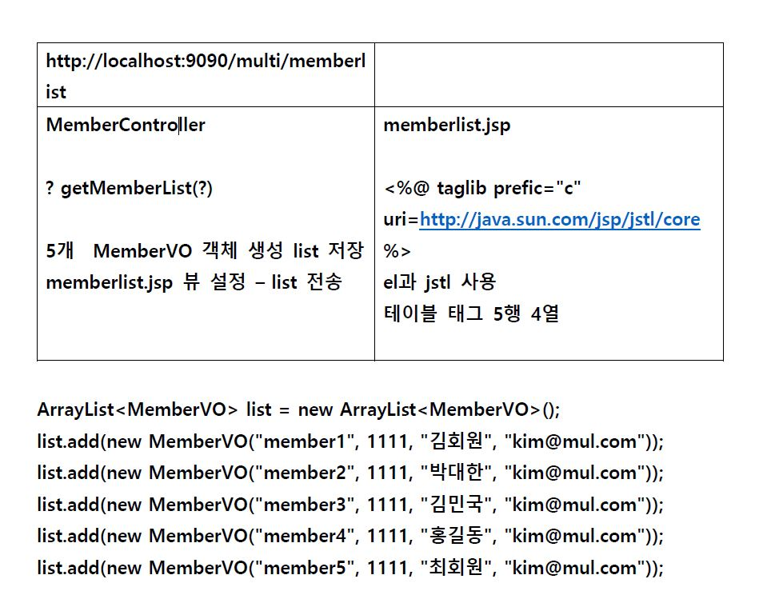

-------------------------


## MemberVO.java

```java
package assign1;

public class MemberVO {
	String id;
	int pw;
	String name;
	String email;
	
    public MemberVO() {}
		
	public MemberVO(String id, int pw, String name, String email) {
		super();
		this.id = id;
		this.pw = pw;
		this.name = name;
		this.email = email;
	}	
		
	public String getId() {
		return id;
	}
	public void setId(String id) {
		this.id = id;
	}
	public int getPw() {
		return pw;
	}
	public void setPw(int pw) {
		this.pw = pw;
	}
	public String getName() {
		return name;
	}
	public void setName(String name) {
		this.name = name;
	}
	public String getEmail() {
		return email;
	}
	public void setEmail(String email) {
		this.email = email;
	}
	
}

```

> * MemberVO 클래스를 선언하고 기본생성자(public MemberVO() {}) 와 저장할 값이 들어갈 생성자(public MemberVO(String id, int pw, String name, String email))를 오버로딩해 생성
> * ModelAttribute로 불러올 것이므로 getter,setter를 선언해준다


## MemberController.java

```java
package assign1;
import java.util.ArrayList;
import org.springframework.stereotype.Controller;
import org.springframework.web.bind.annotation.ModelAttribute;
import org.springframework.web.bind.annotation.RequestMapping;
import org.springframework.web.servlet.ModelAndView;
@Controller
public class MemberController {
	@RequestMapping("/memberlist")
	public ModelAndView memberlist(@ModelAttribute("vo") MemberVO vo ) throws Exception {
		ArrayList<MemberVO> list =new ArrayList<MemberVO>();
		list.add(new MemberVO("member1", 1111, "김회원", "kim@mul.com"));
		list.add(new MemberVO("member2", 2222, "박대한", "park@mul.com")); 
		list.add(new MemberVO("member3", 3333, "김민국", "min@mul.com")); 
		list.add(new MemberVO("member4", 4444, "홍길동", "hong@mul.com")); 
		list.add(new MemberVO("member5", 5555, "최회원", "choi@mul.com"));
		ModelAndView mv = new ModelAndView();
		mv.addObject("mem", list );
		mv.setViewName("memberlist");
		return mv;
	}
}

```

> * @Controller 와 @RequestMapping("/memberlist")를 선언한다.
>
> ```java
> public ModelAndView memberlist(@ModelAttribute("vo") MemberVO vo ) throws Exception {
> ```
>
> * @ModelAttribute("vo") jsp에서 쓸수있는 vo를 지정하겠다
> * (vo 변수이름 = form 파라미터이름) 자동 전달 - set.Id, set.Pw 호출 
>
> ```java
> ArrayList<MemberVO> list =new ArrayList<MemberVO>();
> ```
>
> * ArrayList객체(list) 를 만들고 list.add로 입력값을 저장한다
>
> ```java
> ModelAndView mv = new ModelAndView();
> ```
>
> * MAV 객체를 생성한다
>
> ```java
> mv.addObject("mem", list );
> mv.setViewName("memberlist");
> return mv;
> ```
>
> * mv에 위의 Arraylist(list)값을 "mem" 변수에 저장한다.
> * 참고할 jsp이름 "memberlist"을 mv.setViewName한다.
> * mv를 최종적으로 리턴한다.


## servlet-context.xml

```java
	<context:component-scan base-package="assign1" />
```

> * Annotation (@Controller, @RequestMapping("/memberlist")) 을 사용하기 위해 servlet-context 에 선언한다.


## memberlist.jsp

```javascript
<%@ page language="java" contentType="text/html; charset=UTF-8"
    pageEncoding="UTF-8"%>
<%@ taglib prefix="c" uri="http://java.sun.com/jsp/jstl/core" %>
<!DOCTYPE html>
<html>
<head>
<meta charset="UTF-8">
<title>Insert title here</title>
</head>
<body>
<h1>멤버리스트</h1>
<table border="2">
<tr align="center" bgcolor="aqua">
<td><b>id</b></td>
<td><b>pw</b></td>
<td><b>name</b></td>
<td><b>email</b></td>
</tr>
<c:forEach var="member"  items="${mem}">
<tr align="center">
<td>${member.id }</td>
<td>${member.pw }</td>
<td>${member.name }</td>
<td>${member.email }</td>
</tr>
</c:forEach>
</table>
</body>
</html>
```

> ```javascript
> <%@ taglib prefix="c" uri="http://java.sun.com/jsp/jstl/core" %>
> ```
>
> * jstl을 사용할것이므로 선언해둔다
>
> ```javascript
> <body>
> <h1>멤버리스트</h1>
> <table border="2">
> <tr align="center" bgcolor="aqua">
> <td><b>id</b></td>
> <td><b>pw</b></td>
> <td><b>name</b></td>
> <td><b>email</b></td>
> </tr>
> ```
>
> * 테이블 속성표 생성
>
> ```javascript
> <c:forEach var="member"  items="${mem}">
> <tr align="center">
> <td>${member.id }</td>
> <td>${member.pw }</td>
> <td>${member.name }</td>
> <td>${member.email }</td>
> </tr>
> </c:forEach>
> </table>
> </body>
> ```
>
> * jstl언어  <c:forEach 로 list를 불러온다
> * var= **jstl(${ }) 에서 사용할 변수명**
> * items= **Controller에서 가져올 list 데이터** ("mem"에 저장되어있는)를 jstl로 입력한다"${mem}"
> * 각각 <td> 로 감싸고 var변수명 member에 VO객체에 지정된 변수명(id,pw,name,email) 을 입력하면 향상된 for 문을 통해 저장된값들이 테이블로 출력된다.


-------------------------


## 어려웠던점

> * annotataion을 따로 선언하지 않아 오류가 났다.
>
> * servlet-context 에서 annotation 선언을 따로 입력해야됐다.
>
> * VO에서 기본생성자 (public MemberVO() {})를 선언하지 않아 오류가 발생했다.
>
> * var는 jstl 에서 사용할 변수, items jstl 에 사용될 데이터 (Controller 에서 불러온다.)
>
> * jstl 을 사용할때 ${member}만 사용할 경우 데이터는 불러오나 그 값이 깨져서 나오므로 
>
>   VO객체의 변수명과도 일치시킨다.